# Neil's Funky Lots
Parking lot simulation applicaton including:
* Lot administration
* Arrival kiosk
* Payment kiosk
* Departure kiosk
The solution is presented within a single integrated application for ease of demonstration.

## Link
- https://neilsfunkylots.heroku.com

## Technology
- MongoDB, Express, React, Node

## Overview
The application’s home page is the main Admin screen where you can add and edit lots.
You can navigate to each of the Arrival, Payment and Departure kiosk pages via the hamburger menu.
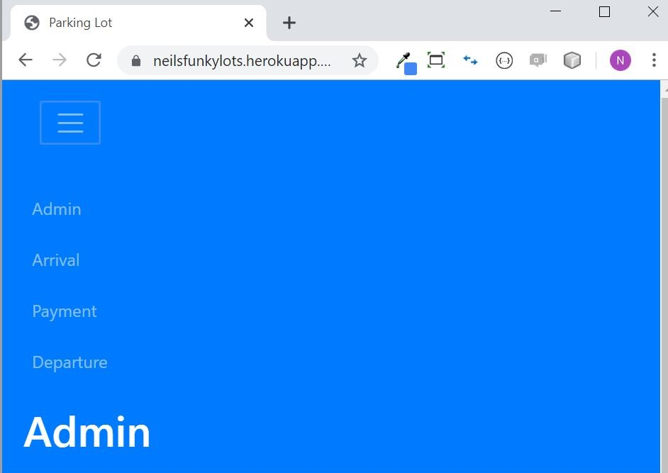
The Arrival, Payment and Departure pages represent three types of kiosks that you would find at each parking lot.  Upon visiting these pages the first time, you must select the lot that your particular instance of the kiosk is running at.  Once the lot is selected, the kiosk will start.
 
## Quick Walkthrough
We will create a new parking lot, then start and use an Arrival, Payment and Departure kiosk (each in a separate browser window) for that lot.

1.  Visit https://neilsfunkylots.heroku.com
2.  From the home page, Click on the ‘+’ to add a new lot.
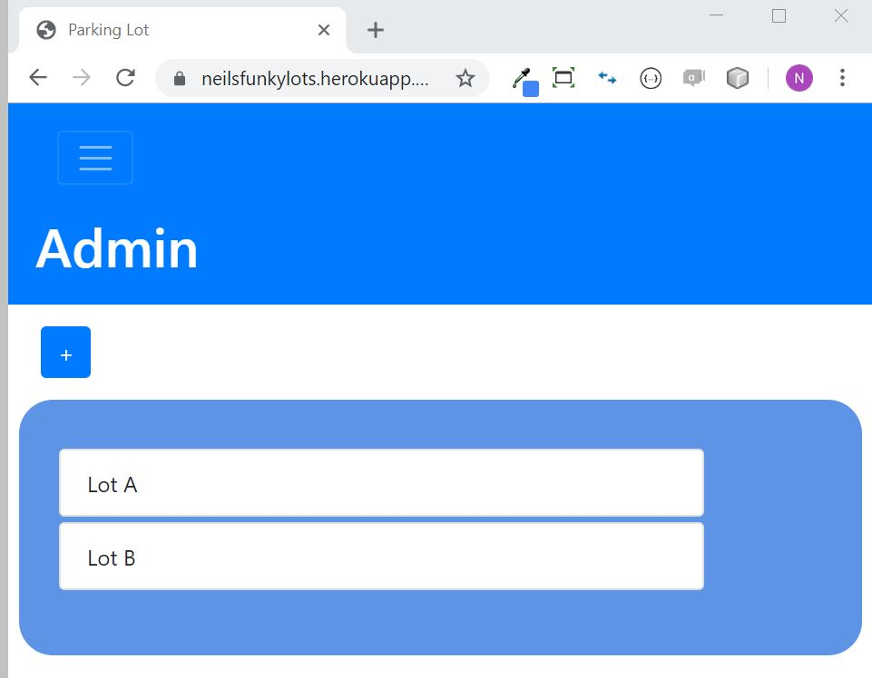
3.  Enter a name, capacity (# of parking spots; pick something greater than zero) and departure leeway (how long someone has from the time they pay their ticket until the time they must drive out of the lot).
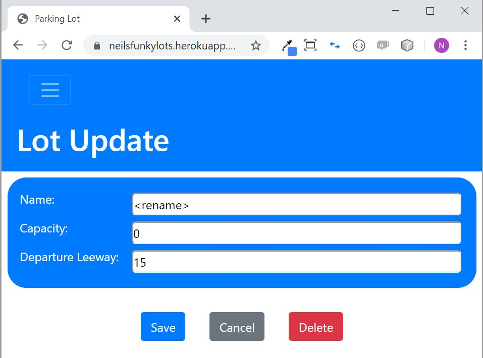
4.  Click save.
5.  Select Arrival from the hamburger menu.
6.  Click on the lot you just created.
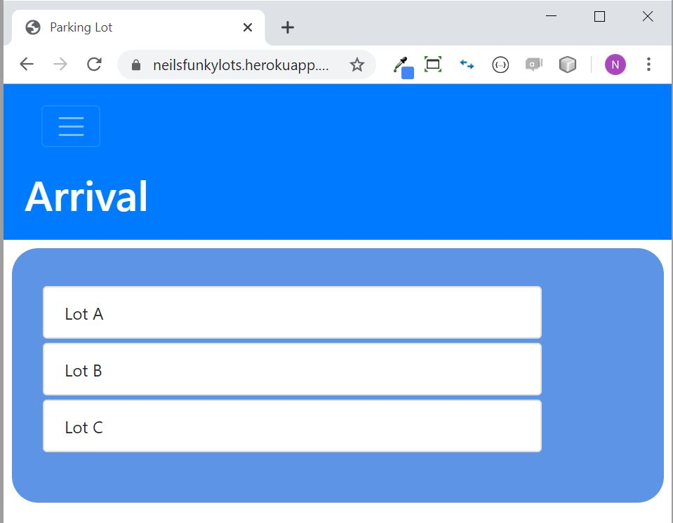
7.  This browser window is now an Arrival kiosk.
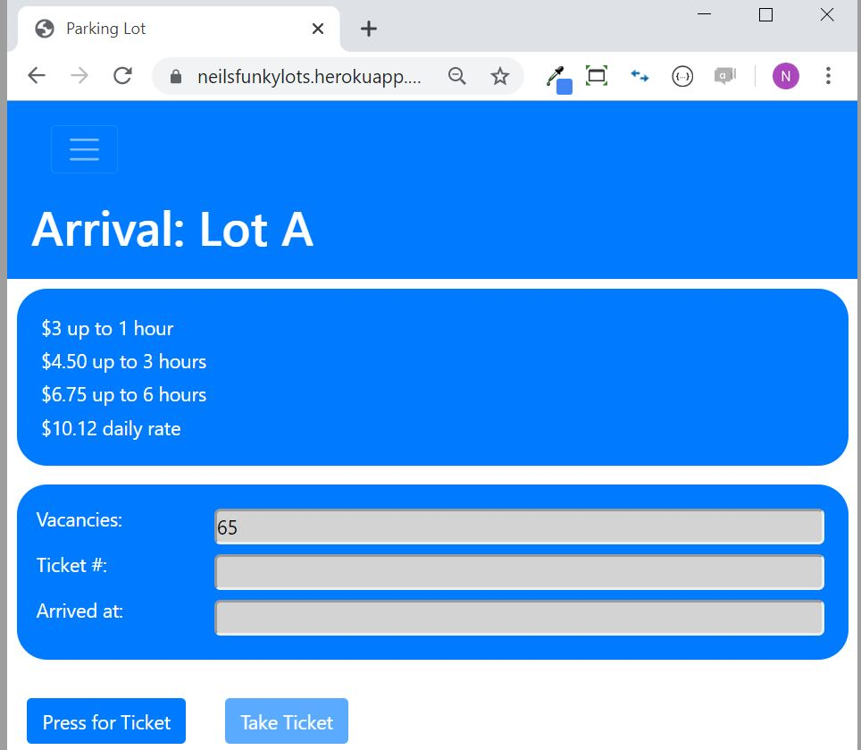
8.  Open a second browser window and visit https://neilsfunkylots.heroku.com
9.  Select Payment from the hamburger menu.
10.  Click on your lot.
11.  This browser is now a Payment kiosk.
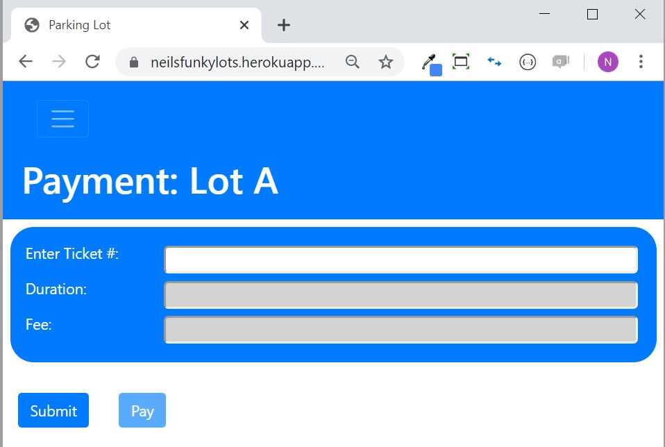
12.  Open a third browser window and visit https://neilsfunkylots.heroku.com
13.  Select Departure from the hamburger menu.
14.  This browser is now a Departure kiosk.  You now have one of each type of kiosk up and running for your parking lot.
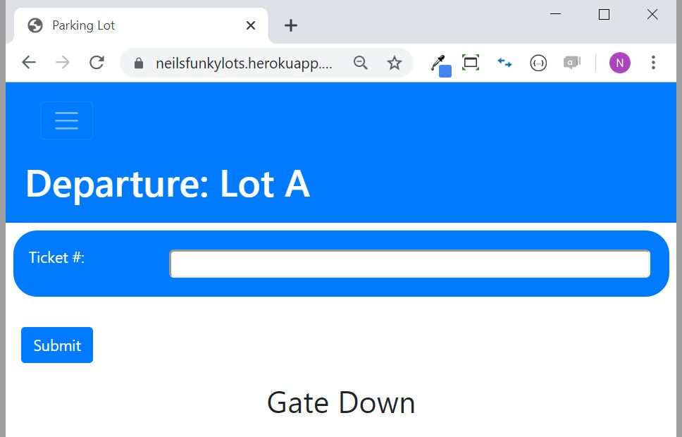
15.  In the Arrival kiosk, click “Press for Ticket” to receive a ticket.  (Since I can’t physically issue you a ticket, copy the ticket number).
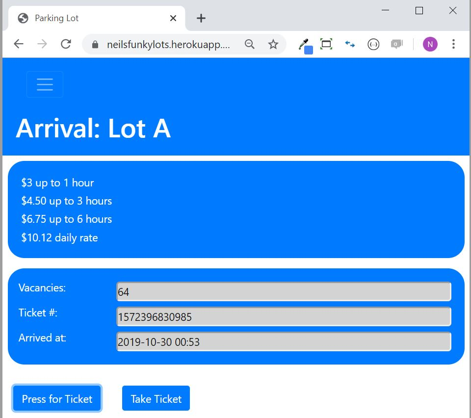
16.  In the Payment kiosk, paste your ticket number into the “Enter Ticket #” field.
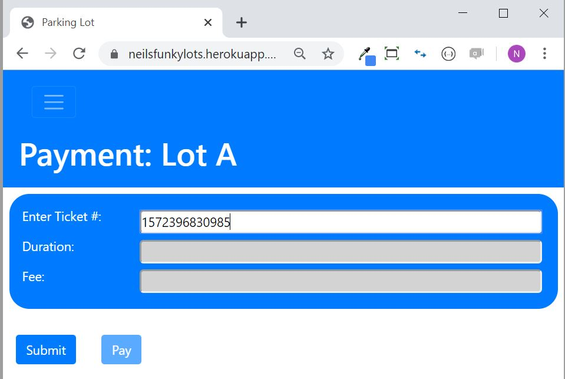
17.  Click “Submit.  If a valid ticket number is entered, the duration of the stay and the fee that will be charged will be displayed.
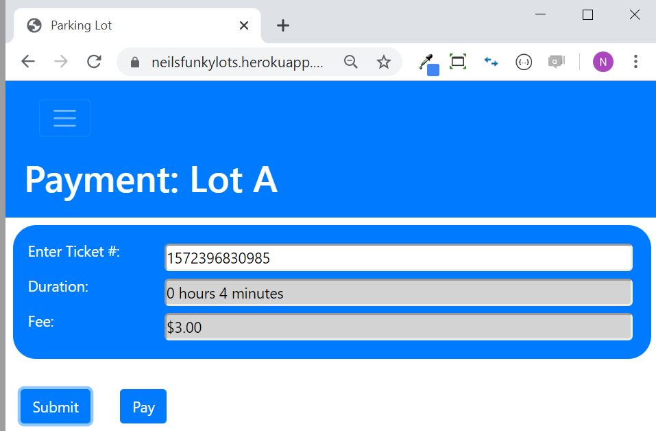
18.  Click “Pay” to virtually pay for the ticket.
19.  In the Departure kiosk, paste your ticket number into the “Ticket #” field.
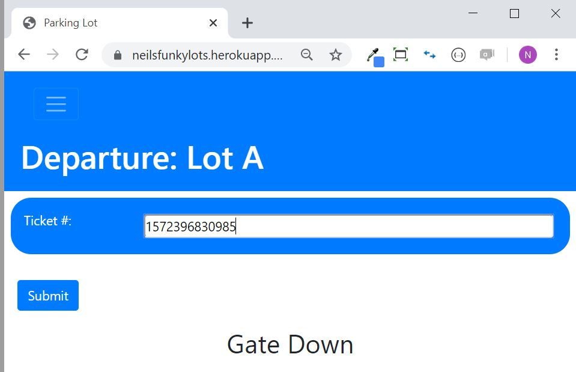
20.  Click “Submit”.  If the ticket # was valid and was paid, the gate will lift long enough for you to drive away!
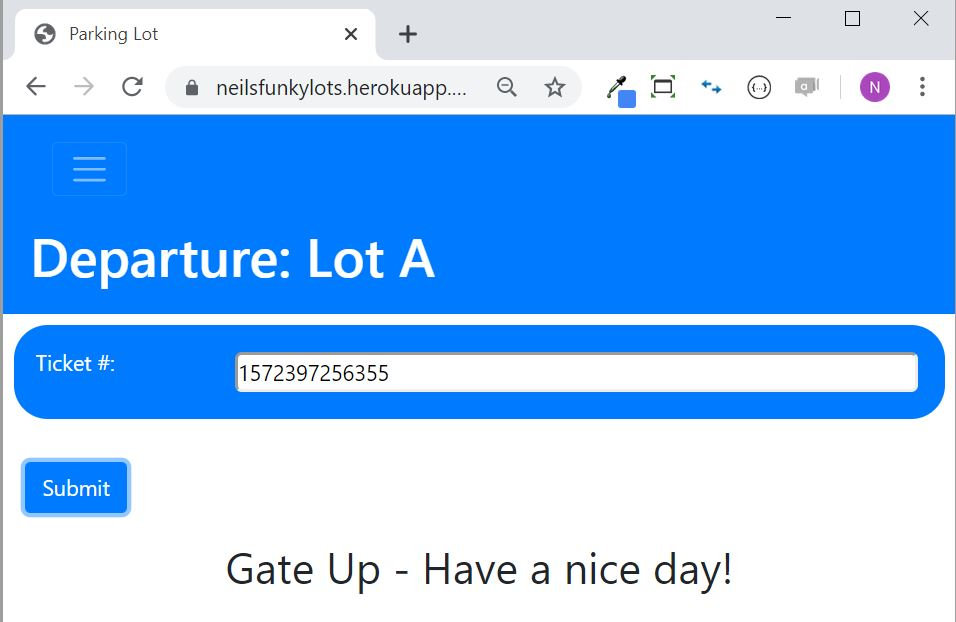

## Some additional notes
1. The application requires a "lotdefaults" collection to exist in your MongoDB, that will house some required configurable settings.  Here is a sample:

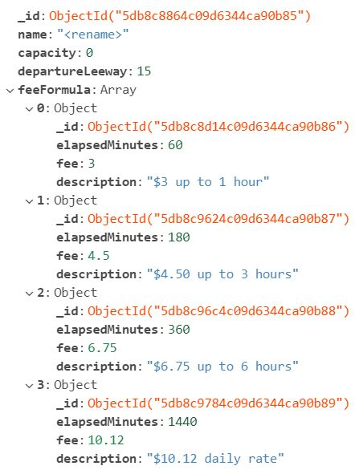

2. Payment history is tracked in a "payments" collection so you can do analysis and reporting on your sales performance!
